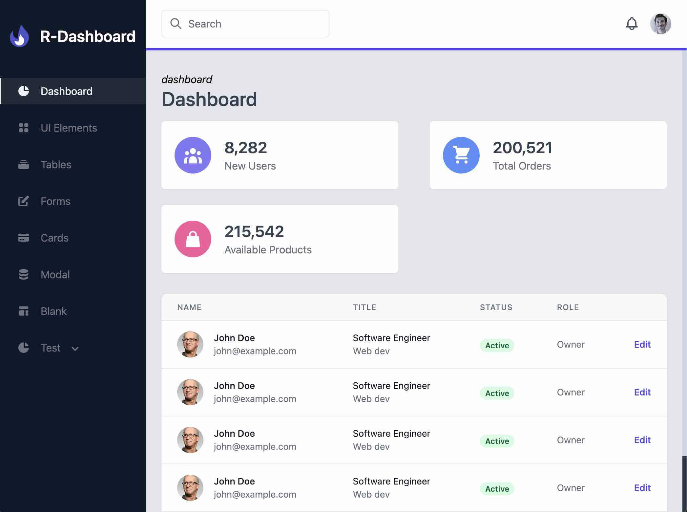

# iris-client
A template for admin console: Rust + Salvo + Dioxus

Server repo: https://github.com/clia/iris-server

by rust + dioxus + tailwindcss

* install trunk
* install tailwind
* run: trunk serve
* open http://localhost:8080/

